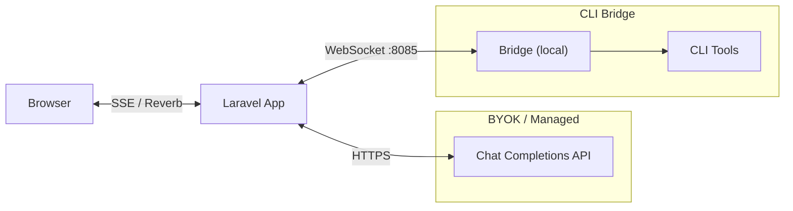

# Laravel AI Bridge

[](https://packagist.org/packages/tetrixdev/laravel-ai-bridge)
[](LICENSE)
[](https://php.net)
[](https://laravel.com)

A unified AI streaming interface for Laravel. Connect any Chat Completions-compatible provider (OpenAI, Anthropic, Groq, Ollama, etc.) or local CLI tools (Codex, Claude, Gemini) to your app through a single, normalized streaming pipeline.

## What is this?

Laravel AI Bridge provides a unified streaming pipeline: **provider -> normalized events -> browser**. No matter where the AI response originates, your application receives the same `StreamEvent` objects through the same callback API. Three modes of operation cover every use case:

- **BYOK (Bring Your Own Key)** -- User provides an API key and endpoint. No local install needed.
- **Managed** -- Your app provides the API key. Same code path as BYOK, different config source.
- **CLI Bridge** -- User runs `npx @tetrixdev/ai-bridge` locally. Their CLI tools (Codex, Claude, Gemini) connect to your app via a dedicated WebSocket server.

## Installation

```bash
composer require tetrixdev/laravel-ai-bridge
```

Publish the config file:

```bash
php artisan vendor:publish --tag=ai-bridge-config
```

Publish the JavaScript client (optional):

```bash
php artisan vendor:publish --tag=ai-bridge-js
```

Add to your `.env`:

```env
# Required for all modes
AI_BRIDGE_TOKEN_SECRET=your-random-secret-here

# For BYOK / Managed mode
AI_BRIDGE_MODE=byok
AI_BRIDGE_ENDPOINT=https://api.openai.com
AI_BRIDGE_API_KEY=sk-...
AI_BRIDGE_MODEL=gpt-4o

# For CLI Bridge mode
AI_BRIDGE_MODE=bridge
AI_BRIDGE_SERVER_HOST=0.0.0.0
AI_BRIDGE_SERVER_PORT=8085
```

## Quick Start

A minimal BYOK example in three steps.

### 1. Configure `.env`

```env
# Generate with: openssl rand -hex 32
AI_BRIDGE_TOKEN_SECRET=REPLACE_WITH_OUTPUT_OF_openssl_rand_hex_32
AI_BRIDGE_MODE=byok
AI_BRIDGE_ENDPOINT=https://api.openai.com
AI_BRIDGE_API_KEY=sk-your-key
AI_BRIDGE_MODEL=gpt-4o
```

### 2. Create a Controller

```php
<?php

namespace App\Http\Controllers;

use Tetrix\AiBridge\Facades\AiBridge;

class ChatController extends Controller
{
    public function stream(Request $request)
    {
        // NOTE (UX-001): conversation_id must stay CONSTANT across all messages in the
        // same conversation. Generating a new ID on every request (e.g. uniqid()) creates
        // a brand-new conversation each time, so the AI has no memory of previous messages.
        // Store the ID in the session and reuse it for follow-up messages.
        $conversationId = $request->input('conversation_id')
            ?? $request->session()->get('ai_conversation_id')
            ?? 'conv-' . Str::uuid();
        $request->session()->put('ai_conversation_id', $conversationId);

        return AiBridge::streamToResponse(
            conversationId: $conversationId,
            message: $request->input('message'),
            options: [
                'system_prompt' => 'You are a helpful assistant.',
            ],
        );
    }
}
```

### 3. Create a Blade View

```html
<div id="chat">
    <div id="messages"></div>
    <div id="loading" style="display:none; color: grey;">AI is thinking...</div>
    <div id="error" style="color: red; display: none;"></div>
    <input type="text" id="input" placeholder="Type a message...">
    <button id="send-btn" onclick="send()">Send</button>
</div>

<script src="/js/vendor/ai-bridge.js"></script>
<script>
// NOTE (UX-001): Generate conversationId ONCE at page load and reuse it for all
// messages in this conversation. Regenerating on each send() creates a fresh
// conversation every time and the AI loses all context from previous messages.
const conversationId = 'conv-' + crypto.randomUUID();

const stream = new AiBridgeStream({
    mode: 'sse',
    url: '/ai-bridge/stream/sse',
});

// SEC: Use textContent instead of innerHTML — AI-generated content is untrusted
// and must not be inserted as raw HTML. If you need markdown rendering, use
// a sanitizer such as DOMPurify: el.innerHTML = DOMPurify.sanitize(rendered)
stream.on('text', (content) => {
    const el = document.getElementById('messages');
    el.textContent += content;
});

stream.on('done', () => {
    document.getElementById('messages').textContent += '\n\n';
    document.getElementById('loading').style.display = 'none';
    document.getElementById('send-btn').disabled = false;
    document.getElementById('input').disabled = false;
});

// UX-008: Also handle cancelled so UI is never left stuck after destroy() or cancellation
stream.on('cancelled', () => {
    document.getElementById('loading').style.display = 'none';
    document.getElementById('send-btn').disabled = false;
    document.getElementById('input').disabled = false;
});

stream.on('error', (code, message) => {
    const el = document.getElementById('error');
    el.textContent = `Error: ${message}`;
    el.style.display = 'block';
    document.getElementById('loading').style.display = 'none';
    document.getElementById('send-btn').disabled = false;
    document.getElementById('input').disabled = false;
});

function send() {
    const input = document.getElementById('input');
    if (!input.value.trim()) return;

    // Disable input during streaming and show loading indicator (UX-008)
    document.getElementById('send-btn').disabled = true;
    input.disabled = true;
    document.getElementById('loading').style.display = 'block';
    document.getElementById('error').style.display = 'none';

    // NOTE (UX-001): The conversation_id must remain STABLE across all messages in the
    // same conversation so the AI can remember the context. Generate it ONCE when the
    // page loads and reuse it for every send() call in this conversation session.
    // Using Date.now() here would create a new conversation on every message.
    stream.send({ message: input.value, conversation_id: conversationId });
    input.value = '';
}
</script>
```

## Modes of Operation

### BYOK (Bring Your Own Key)

The user provides an API key and endpoint for any Chat Completions-compatible provider. The server calls the API directly -- no local install required on the user's machine.

```php
$stream = AiBridge::stream('conv-1', 'Hello!', [
    'mode' => 'byok',
    'api_key' => $user->ai_api_key,        // per-user key
    'endpoint' => 'https://api.openai.com',
    'model' => 'gpt-4o',
    'system_prompt' => 'You are a game master.',
]);

$stream->onBlockDelta(fn ($event) => $this->appendToChat($event->data['content']));
$stream->onDone(fn ($usage) => $this->logUsage($usage));
$stream->start();
```

Works with any Chat Completions-compatible endpoint: OpenAI, Anthropic (via proxy), Groq, Together, Ollama, LM Studio, vLLM, etc.

### Managed

Identical to BYOK but the application provides its own API key. Users pay the app a subscription fee. No separate architecture needed -- same code path, different config source.

```env
AI_BRIDGE_MODE=managed
AI_BRIDGE_ENDPOINT=https://api.openai.com
AI_BRIDGE_API_KEY=sk-your-app-key
AI_BRIDGE_MODEL=gpt-4o
```

```php
// No per-user key needed -- uses the app's configured key
$stream = AiBridge::stream('conv-1', 'Hello!', [
    'system_prompt' => 'You are a helpful assistant.',
]);
$stream->start();
```

### CLI Bridge

The user installs the bridge locally via `npx @tetrixdev/ai-bridge`. It connects to your app's dedicated WebSocket server and proxies AI requests through their local CLI tools (using their existing subscriptions).

```env
AI_BRIDGE_MODE=bridge
AI_BRIDGE_TOKEN_SECRET=your-secret
AI_BRIDGE_SERVER_PORT=8085
```

Start the bridge server:

```bash
php artisan ai-bridge:serve
```

Generate a token for the user, then have them connect:

```bash
php artisan ai-bridge:token --user-id=42

# User runs on their machine:
npx @tetrixdev/ai-bridge --server=ws://yourapp.com:8085 --token=<JWT>
```

The server-side code is identical:

```php
$stream = AiBridge::stream('conv-1', 'Hello!', [
    'user_id' => $user->id,
]);
$stream->onBlockDelta(fn ($event) => echo $event->data['content']);
$stream->start();
```

## Configuration

Full reference for `config/ai-bridge.php`:

| Key | Env Variable | Default | Description |
|-----|-------------|---------|-------------|
| `mode` | `AI_BRIDGE_MODE` | `byok` | Active mode: `byok`, `managed`, or `bridge` |
| `token.secret` | `AI_BRIDGE_TOKEN_SECRET` | `null` | JWT signing secret (required) |
| `token.ttl` | `AI_BRIDGE_TOKEN_TTL` | `86400` | Token TTL in seconds (24h) |
| `websocket.heartbeat_interval` | -- | `30` | Seconds between ping/pong |
| `websocket.request_timeout` | -- | `300` | Seconds before AI request timeout |
| `chat_completions.endpoint` | `AI_BRIDGE_ENDPOINT` | `null` | Chat Completions API base URL |
| `chat_completions.api_key` | `AI_BRIDGE_API_KEY` | `null` | API key for BYOK/managed |
| `chat_completions.model` | `AI_BRIDGE_MODEL` | `null` | Model name (e.g. `gpt-4o`) |
| `chat_completions.max_tokens` | `AI_BRIDGE_MAX_TOKENS` | `4096` | Max response tokens |
| `server.host` | `AI_BRIDGE_SERVER_HOST` | `127.0.0.1` | Bridge WebSocket server bind address (set to `0.0.0.0` in Docker/multi-host setups) |
| `server.port` | `AI_BRIDGE_SERVER_PORT` | `8085` | Bridge WebSocket server port |
| `broadcasting.enabled` | `AI_BRIDGE_BROADCAST` | `true` | Enable Reverb broadcasting |
| `broadcasting.connection` | `AI_BRIDGE_BROADCAST_CONNECTION` | `reverb` | Broadcasting connection name |
| `streaming.suppress_thinking_blocks` | `AI_BRIDGE_SUPPRESS_THINKING` | `true` | Suppress AI chain-of-thought / thinking blocks from SSE and broadcast output. Set to `false` only when intentionally displaying AI reasoning to users. |

## Streaming to Browser

Two methods for delivering AI responses to the browser.

### SSE (Server-Sent Events)

Returns an SSE HTTP response. Simplest approach -- no extra infrastructure needed.

```php
// In your controller
public function stream(Request $request)
{
    return AiBridge::streamToResponse(
        conversationId: $request->input('conversation_id'),
        message: $request->input('message'),
        options: [
            'system_prompt' => $request->input('system_prompt', ''),
        ],
    );
}
```

Or use the built-in endpoint:

```
POST /ai-bridge/stream/sse
Content-Type: application/json

{
    "conversation_id": "conv-123",
    "message": "Hello!",
    "system_prompt": "You are a helpful assistant."
}
```

The response is `text/event-stream` with normalized events:

```
data: {"event":"block_start","data":{"block_type":"text","block_index":0}}

data: {"event":"block_delta","data":{"block_type":"text","block_index":0,"content":"Hello"}}

data: {"event":"block_delta","data":{"block_type":"text","block_index":0,"content":"!"}}

data: {"event":"block_stop","data":{"block_type":"text","block_index":0}}

data: {"event":"done","data":{"usage":{"prompt_tokens":10,"completion_tokens":5}}}

data: [DONE]
```

### Reverb Broadcasting

Pushes events to a Laravel Reverb channel. Ideal for multiplayer scenarios where multiple users see the same AI response.

```php
// In your controller -- returns immediately
public function generate(Request $request)
{
    $requestId = AiBridge::streamAndBroadcast(
        conversationId: $request->input('conversation_id'),
        message: $request->input('message'),
        channel: 'game.' . $request->input('game_id'),
        options: [
            'system_prompt' => 'You are a game master.',
        ],
    );

    return response()->json([
        'status' => 'started',
        'request_id' => $requestId,
    ]);
}
```

Or use the built-in endpoint:

```
POST /ai-bridge/stream/broadcast
Content-Type: application/json

{
    "conversation_id": "conv-123",
    "message": "I search the room",
    "channel": "game.456",
    "system_prompt": "You are a game master."
}
```

Listen on the client with Laravel Echo / Reverb:

```javascript
Echo.channel('game.456')
    .listen('.ai.stream', (e) => {
        console.log(e.event, e.data);
    });
```

## JavaScript Client

A lightweight (~100 lines) vanilla JS module that handles both SSE and Reverb modes. Publish it first:

```bash
php artisan vendor:publish --tag=ai-bridge-js
```

This copies `ai-bridge.js` to `resources/js/vendor/ai-bridge.js`.

**Using with Vite (recommended):** Import it in your `resources/js/app.js`:

```js
import './vendor/ai-bridge.js';
```

**Manual approach:** Copy the file to `public/js/vendor/ai-bridge.js` and include with a script tag:

```html
<script src="/js/vendor/ai-bridge.js"></script>
```

### SSE Mode

```javascript
const stream = new AiBridgeStream({
    mode: 'sse',
    url: '/ai-bridge/stream/sse',
});

stream.send({
    message: 'I search the room',
    conversation_id: 'conv-123',
    system_prompt: 'You are a game master.',
});

stream.on('text', (content) => {
    // Append text to chat UI
});

stream.on('thinking', (content) => {
    // Show thinking indicator
});

stream.on('tool_call', (name, params) => {
    // Show tool usage in UI
});

stream.on('done', (usage) => {
    // Finalize, show token counts
});

stream.on('error', (code, message) => {
    // Handle error
});
```

### Reverb Mode

```javascript
const stream = new AiBridgeStream({
    mode: 'reverb',
    channel: 'game.456',
    // Requires Laravel Echo to be configured
});

stream.send({
    message: 'I cast fireball',
    conversation_id: 'conv-123',
});

stream.on('text', (content) => { /* ... */ });
stream.on('done', (usage) => { /* ... */ });
```

### With Alpine.js

```html
<div x-data="chat()" x-init="init()">
    <div x-text="messages"></div>
    <input x-model="input" @keydown.enter="send()" :disabled="isStreaming">
    <button @click="send()" :disabled="isStreaming">Send</button>
</div>

<script src="/js/vendor/ai-bridge.js"></script>
<script>
function chat() {
    return {
        messages: '',
        input: '',
        isStreaming: false,
        stream: null,
        init() {
            this.stream = new AiBridgeStream({
                mode: 'sse',
                url: '/ai-bridge/stream/sse',
            });
            this.stream.on('text', (content) => {
                this.messages += content;
            });
            this.stream.on('done', () => {
                this.messages += '\n\n';
                this.isStreaming = false;
            });
            this.stream.on('cancelled', () => {
                this.isStreaming = false;
            });
            this.stream.on('error', (code, message) => {
                this.messages += `\n[Error: ${message}]\n`;
                this.isStreaming = false;
            });
        },
        send() {
            // UX: Prevent submitting while streaming or with empty input
            if (this.isStreaming || !this.input.trim()) return;
            this.isStreaming = true;
            this.stream.send({
                message: this.input,
                conversation_id: 'conv-' + Date.now(),
            });
            this.input = '';
        },
    };
}
</script>
```

## Tool System

Register tools that the AI can call during a conversation. Tools work across all three modes.

### Register with a Closure

```php
// In a service provider's boot() method
AiBridge::registerTool(
    name: 'roll_dice',
    description: 'Roll one or more dice',
    parameters: [
        'type' => 'object',
        'properties' => [
            'sides' => ['type' => 'integer', 'description' => 'Number of sides'],
            'count' => ['type' => 'integer', 'description' => 'Number of dice'],
        ],
        'required' => ['sides'],
    ],
    handler: function (array $params) {
        $sides = $params['sides'];
        $count = $params['count'] ?? 1;
        $rolls = [];
        for ($i = 0; $i < $count; $i++) {
            $rolls[] = random_int(1, $sides);
        }
        return ['rolls' => $rolls, 'total' => array_sum($rolls)];
    },
);
```

### Register with a ToolHandler Class

```php
use Tetrix\AiBridge\Contracts\ToolHandler;

class LookupCharacterTool implements ToolHandler
{
    public function name(): string { return 'lookup_character'; }
    public function description(): string { return 'Look up a character in the database'; }
    public function parameters(): array {
        return [
            'type' => 'object',
            'properties' => [
                'name' => ['type' => 'string'],
            ],
            'required' => ['name'],
        ];
    }
    public function handle(array $params): mixed {
        return Character::where('name', $params['name'])->first()?->toArray();
    }
}

// Register it
AiBridge::registerToolHandler(new LookupCharacterTool());
```

### Listening for Tool Calls

```php
$stream = AiBridge::stream('conv-1', 'Roll 2d6 for damage');
$stream->onToolCall(function (string $name, array $params, string $callId) {
    // Tool execution happens automatically if registered.
    // This callback is for UI updates / logging.
    Log::info("AI called tool: {$name}", $params);
});
$stream->start();
```

## Bridge Server

The `ai-bridge:serve` command starts a dedicated WebSocket server for CLI bridge connections. This is **not** Laravel Reverb -- it is a separate, lightweight server on its own port that speaks the AI Bridge Protocol.

```bash
php artisan ai-bridge:serve
```

Options:

```
--host=0.0.0.0    Bind address (default: from config or 0.0.0.0)
--port=8085       Port number (default: from config or 8085)
```

The server:
- Accepts WebSocket connections from bridge clients (`npx @tetrixdev/ai-bridge`)
- Validates JWT tokens from the `?token=` query parameter
- Routes AI request/response messages through the `MessageHandler`
- Tracks connections via `BridgeConnectionManager`
- Handles graceful shutdown on SIGINT/SIGTERM

## Artisan Commands

| Command | Description |
|---------|-------------|
| `ai-bridge:serve` | Start the dedicated WebSocket server for CLI bridge connections |
| `ai-bridge:token` | Generate a JWT connection token for testing |
| `ai-bridge:test` | Send a test request through the configured mode |

### `ai-bridge:serve`

```bash
php artisan ai-bridge:serve --port=8085
```

Starts the bridge WebSocket server. Bridge clients connect to `ws://host:port?token=<JWT>`.

### `ai-bridge:token`

```bash
php artisan ai-bridge:token --user-id=42 --ttl=3600
```

Generates a JWT token for testing bridge connections without needing a full auth flow.

### `ai-bridge:test`

```bash
# Test BYOK mode
php artisan ai-bridge:test "What is 2+2?"

# Test managed mode
php artisan ai-bridge:test "Hello!" --mode=managed

# Test bridge mode (requires active bridge connection)
php artisan ai-bridge:test "Hello!" --mode=bridge
```

Sends a test request and displays streaming events in the console.

## Architecture



```
Browser <--SSE/Reverb--> Laravel App <--WebSocket--> Bridge (local) --> CLI tools
                              |
                         Chat Completions API (BYOK/Managed)
```

**Data flow (BYOK/Managed):**
1. Browser sends message via SSE POST or Reverb trigger
2. Laravel calls Chat Completions API with streaming enabled
3. SSE chunks are normalized into `StreamEvent` objects
4. Events are delivered to browser via SSE response or Reverb broadcast

**Data flow (CLI Bridge):**
1. Browser sends message via SSE POST or Reverb trigger
2. Laravel sends `ai_request` over WebSocket to bridge
3. Bridge pipes message through local CLI tool (Codex, Claude, etc.)
4. CLI output is normalized and streamed back as `StreamEvent` objects
5. Events are delivered to browser via SSE response or Reverb broadcast

## Protocol

The WebSocket protocol between the server and CLI bridge is documented in [PROTOCOL.md](PROTOCOL.md).

## License

MIT. See [LICENSE](LICENSE).
